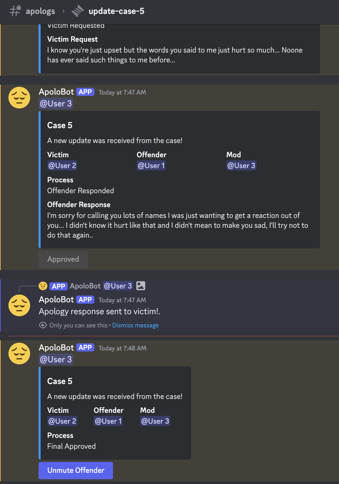

<h2>Conference Papers</h2>

    <!--
    

        
    

    -->
    

        <a id="red-bg" class="pub-title" href="./assets/pdf/papers/apolobot.pdf" style="font-weight: bold">The Design Space for Online Restorative Justice Tools: A Case Study with ApoloBot</a>  
        <b class="pub-me">Bich Ngoc (Rubi) Doan</b>, <a id="red-bg" class="collaborator" href="https://joseph.seering.org/index.html" >Joseph Seering</a> 
         CHI 2025 (to appear) 
    

